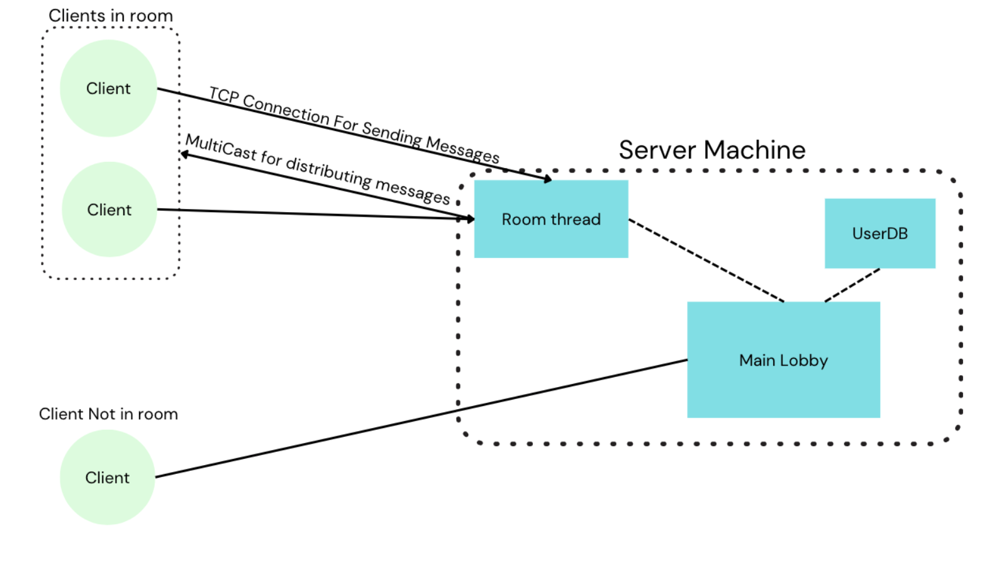
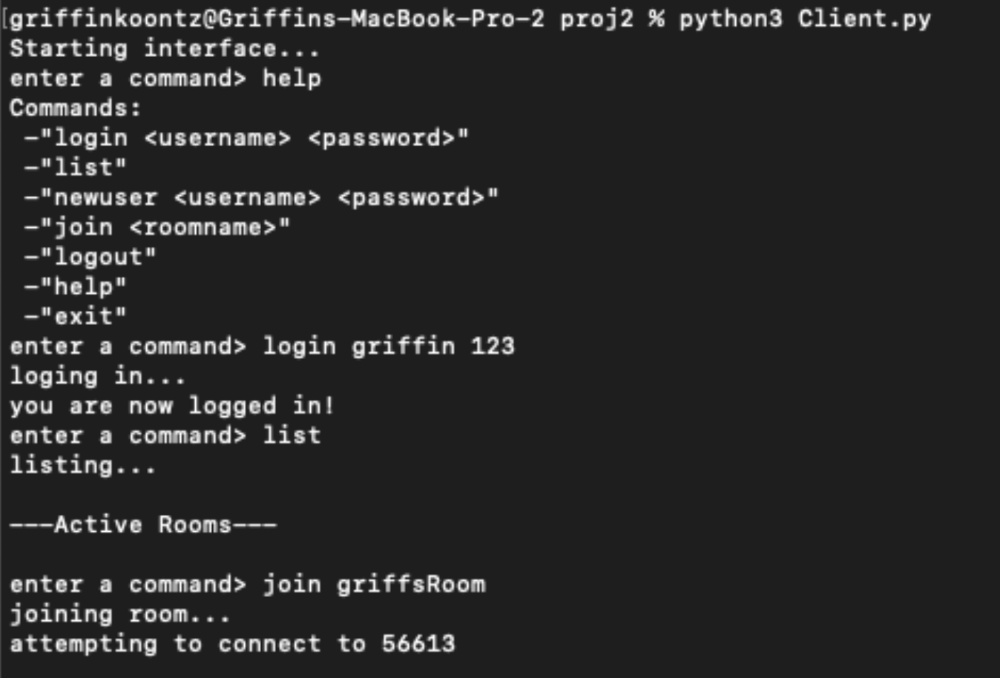
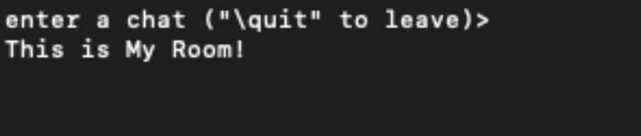
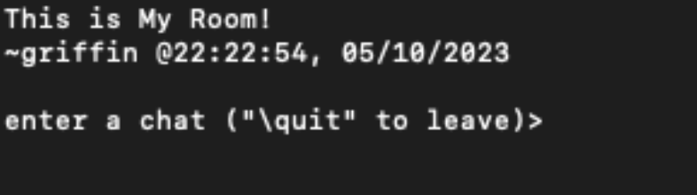
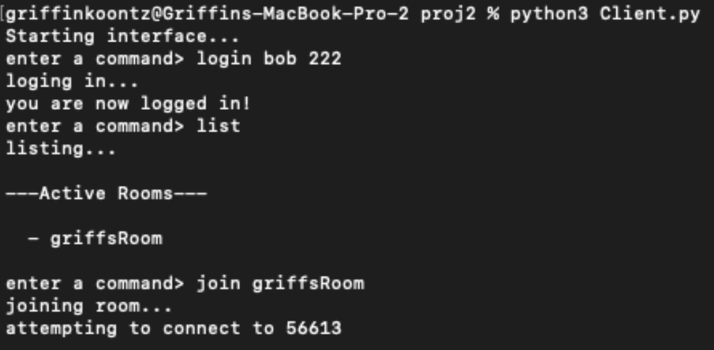
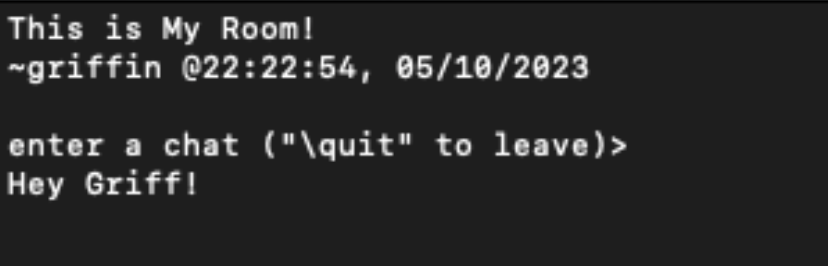
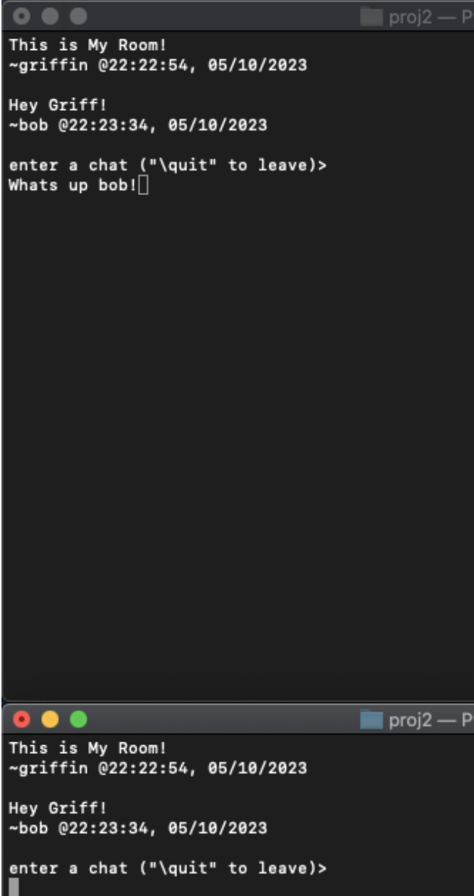
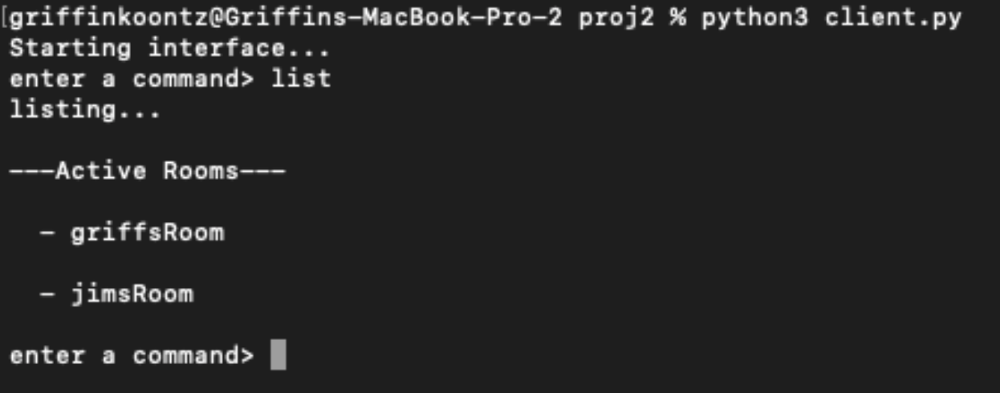

# **Command Line Chatrooms**
Command Line Chat Rooms is a lightweight application for communicating with other 
users across a network. Upon start up a user is connected to the lobby where they can create an 
account to have a personal display name, sign into an existing account, list all active chatrooms, 
join an active chat room, or create and join their own. Once inside a chat room a user will see the 
previous 10 chats within the room. The can then send a new chat to be sent to everyone in the 
room. When a user is done with a chatroom, they can leave by entering the quit command and 
return to the lobby. 

## Architecture
The application consists of a server and a client. The server facilitates user management, room 
creation and deletion, and the routing of chat messages. The client serves as an interface for 
interacting with the server and communicating in chat rooms. Clients will connect to the chat 
server main lobby via TCP. Once they join a room the client will then connect to a room thread 
via TCP and join an associated multicast group for receiving messages from other clients in the 
room.

## Design 
Command line Chatrooms relies on three main data models. User represents a user, containing a username and password. Chat represents a chat message and contains the creator of the chat, the room that chat was sent in, contents of the chat, and the date and time it was sent. Room represents a chat room and contains the name of the room, a short description, a password, and an owner referencing the creator of the room.

## Models

## ClientOperations Module

The client relies on one main module called `ClientOperations`. This module is initialized, and its run method is called by a simple program `Client`, which is the program executed by a user to start the interface.

### Properties

- **TCPcomm**: A TCP communication object that takes a TCP socket and facilitates connection, message sending and receiving, and connection closure.
- **MCso**: A Multicast socket value.
- **MCcomm**: A UDP Multicast communication object that takes a Multicast socket and facilitates connection, message sending and receiving, and connection closure.
- **currentUser**: A user object for the current user.
- **currentRoom**: A room name of the current room.
- **prevChats**: A list of the past 10 chats sent within the current room.

### Methods

- **login**: Sends a login request to the server.
- **logout**: Sends a logout request to the server.
- **createUser**: Sends a create user request to the server.
- **join**: Sends a join request to the server and waits for a response with the TCP and Multicast connection information. Once the connection information is received, it disconnects the client from the lobby and reconnects to the chatrooms TCP and Multicast. Once connected, it waits to receive a TCP message with the previous 10 chats within the room and reads them into `prevChats`.
- **list**: Sends a list request to the server, receives a response with all active rooms, and prints them out.
- **sendChat**: Sends a chat request to a chat server.
- **addPrevChat**: Adds a chat to `prevChats`, removing the oldest chat if there are more than 10 in the list.
- **printChat**: Prints all previous chats and a prompt for the user to input a new chat or quit leave the room.
- **return_to_lobby**: Disconnects TCP and Multicast connections to a chat server and reconnects to the lobby via TCP.
- **chatUI**: An interface that accepts input from the user for writing a message or leaving the room. Loops until the user enters the quit command. Uses select to get data from stdin or from the Multicast connection. If input comes from the Multicast connection, the chat is added to `prevChats`, and `printChat` is called. If input comes from stdin, the loop is ended if it is the quit command or the input is made into a chat message that is sent to the chat server over the TCP connection. Once the loop is broken, `prevChats` is reset, and `return_to_lobby` is called.
- **run**: An interface that takes a command from the user and calls the proper methods.

# Server

The server relies on two main modules called `LobbyOperations` and `ChatOperations`. The `LobbyOperations` module is initialized, and its run method is called by a simple program `LobbyServer`, which is the program executed by a user to start the lobby server. The `ChatOperations` module is initialized, and its run method is called by a simple program `ChatServer`, which is the program executed by `LobbyOperations` to start a chat server.

## LobbyOperations Module

### Properties

- **server**: A TCP server.
- **inputs**: List of inputs used by select.
- **outputs**: List of outputs used by select.
- **Comm**: A TCP communication object that takes a TCP socket and facilitates connection, message sending and receiving, and connection closure.
- **currentUsers**: List of current users.
- **activeRooms**: List of active rooms and their connection information.
- **UserDB**: A `UserDB` object that is used to read and write users to a file that serves as the database.

### Methods

- **login**: Looks up a username in the database and compares the passwords. If the passwords match, the user is added to `currentUsers`. Sends a success or error message to the client.
- **logout**: Removes a user from `currentUsers`.
- **join**: Checks if the requested room is in `activeRooms`. If it is, the room's connection information is sent to the client. Otherwise, connection information is generated, and a new thread is started with the target of `ChatServer` and with arguments of the new connection information. The connection information is then sent to the client.
- **list**: A list response message is sent to the client containing all the rooms in `activeRooms`.
- **createUser**: `UserDB`'s `newuser` method is called with the requested username and password. This adds a user to the database.
- **run**: A main loop that uses select to receive requests from any of the connected clients and routes the request to the correct operation.

## ChatOperations Module

### Properties

- **TCPserver**: A TCP server.
- **inputs**: List of inputs used by select.
- **outputs**: List of outputs used by select.
- **TCPComm**: A TCP communication object that takes a TCP socket and facilitates connection, message sending and receiving, and connection closure.
- **MCComm**: A UDP Multicast communication object that takes a Multicast socket and facilitates connection, message sending and receiving, and connection closure.
- **prevChats**: A list of the past 10 chats sent within the room.

### Methods

- **addPrevChat**: Adds a chat to `prevChats`, removing the oldest chat if there are more than 10 in the list.
- **sendPrevChats**: Sends a TCP message to the client containing the chats in `prevChats`.
- **broadcastChat**: Sends a Multicast chat message.
- **receivedChat**: Adds a received chat to `prevChats` and then sends it to the room with `broadcastChat`.
- **run**: A main loop that uses select to receive requests from any of the connected clients and routes the request to the correct operation. If there are no connections, the loop terminates, and all sockets are closed.

# Demo

A new client has started, and the user has logged in. Active rooms are then listed and show no currently active rooms. The user then requests to join a room that does not yet exist, that means a new one will be created.

The room is then entered. There are no previous chats, but the user is about to send one.

the chat was sent.

Now another client is started. The user logs in and lists the active rooms. The room started by the other user is seen and the user requests to join it.

The room is joined and the previous message from ‘griffin’ can be seen. The user then is about to send their own message.

The chat is received by all users.

Here a list shows multiple active rooms.
